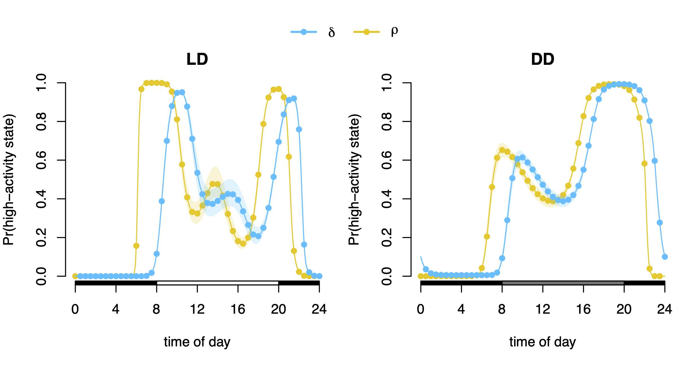
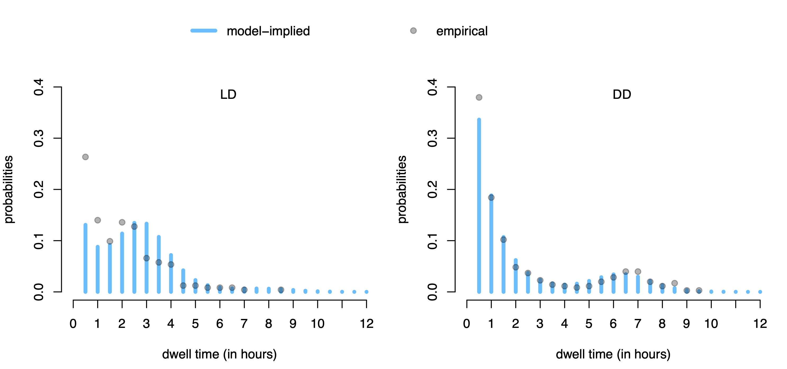

# Drosophila

This repository contains **R** code for conducting the analysis in the
paper [“Inference on the state process of periodically inhomogeneous
hidden Markov models for animal
behavior”](https://arxiv.org/abs/2312.14583), which can be replicated by
executing `Analysis.R`.

In the paper we establish important mathematical properties that allow
for comprehensive statistical inference related to periodically
inhomogeneous hidden Markov models thereby providing guidance for model
building and model checking. Specifically, we derive the **periodically
varying unconditional state distribution** (cf. Figure 1) as well as the
**time-varying** and **overall state dwell-time distributions**
(cf. Figure 2) – all of which are of key interest when the inferential
focus lies on the dynamics of the state process. We use the associated
novel inference and model-checking tools to investigate changes in the
diel activity patterns of fruit flies in response to changing light
conditions.

<figure>

<figcaption aria-hidden="true">Figure 1: Periodically stationary
distribution</figcaption>
</figure>

 

<figure>

<figcaption aria-hidden="true">Figure 2: Overall dwell-time
distribution</figcaption>
</figure>
